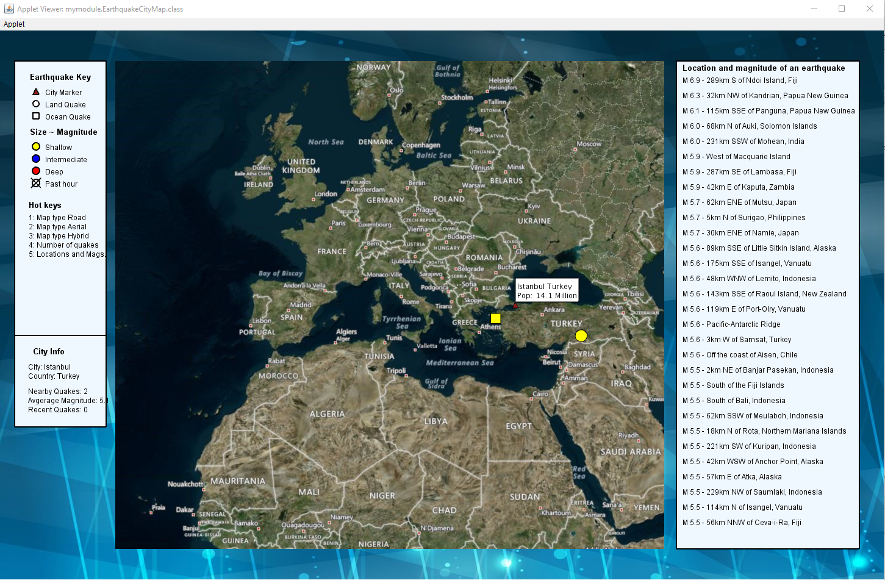

# City map project 

The applet has the following extensions:
* Item 1
•	The map background is replaced by a jpg image, which is nicer. 
•	Hot keys are used to change the map providers for different user preferences. Reset key is applied to refresh the map. 
•	The statistical information of an earthquake (country and number of quakes), and sorted magnitude information (magnitude and location) can be alternatively displayed on the right hand side of the map.
•	The statistical information of a city will be shown on the left hand side of the map when it is clicked on. 

\

