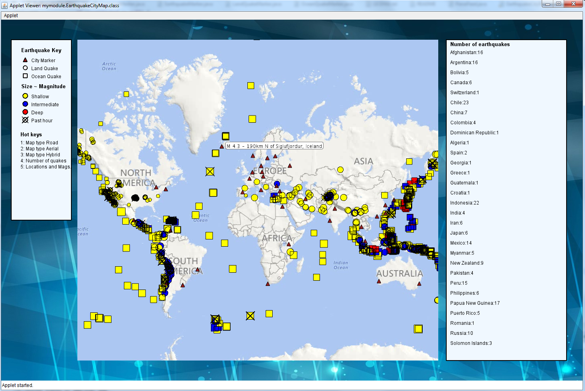

# City map project extension

The applet has the following extensions:

1. Map providers are selected by keys:
   * Hot keys are used to change the map providers for different user preferences. I use Microsoft’s aerial, road, and hybrid map providers (key1,2, and 3). Key c will clear and update the map.

2. Statistical information display (from all the countries)
   * The statistical information of an earthquake (country and number of quakes), and sorted magnitude information (magnitude and location) can be alternatively displayed on the right hand side of the map. It will display two kinds of information on the right hand side of the map instead of printing them in the console. 
   * Key 4: show the country name, and the number of quakes in each country (up to 30). 
   * Key 5: display the location and magnitude information sorted by the magnitude in reverse order(up to 30). The right text box will be changed alternatively by clicking key 4 and 5.
3. City statistics (when city marker is clicked on):
   * When the city has any nearby quakes (within a threat circle), the city name, country, number of nearby earthquakes, and average magnitude will be shown on the left hand side of the map.    
4. The map background is replaced by a jpg image, which is nicer. The applet sorts earthquakes in reverse order of magnitude (step3,4) and also prints them in the console.

